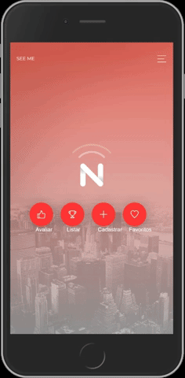
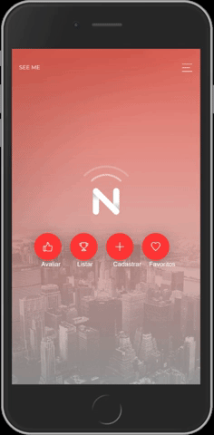
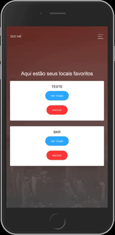

# DOCUMENTAÇÃO SEE-ME-2.0: 
# DEMO: https://seeme-16d83.web.app/index
 
O objetivo desta atividade é fazer com que vocês experimentem a construção de uma aplicação web progressiva.
Para isso, o seu grupo deve criar uma PWA que atenda aos seguintes requisitos:

 - [x] Conter pelo menos duas páginas HTML, formatadas adequadamente para smartphones por meio da CSS;
 - [x] A aplicação deve possuir um manifesto que permita a instalação na tela inicial dos dispositivos dos usuários;

##### Usar armazenamento local de dados, por meio da API Web Storage ou da API IndexedDB, considerando:
- [x] a. Os dados armazenados devem ser específicos do usuário (determinados automaticamente ou informados por meio de um formulário);
- [x] b. Os dados armazenados devem ser usados em alguma funcionalidade da aplicação (mesmo que apenas a apresentação em alguma página);

##### A aplicação deve possuir um service worker que:
- [x] a. Implemente corretamente a instalação e a ativação da aplicação;
- [x] b Permita o funcionamento offline da aplicação.

## Observações importantes:

1. O grupo deste projeto será o mesmo grupo do projeto anterior.
2. A criatividade e originalidade serão avaliadas. Em outras palavras, espera-se que a aplicação seja de fato criada pelo grupo (e não copiada da Internet ou de outro grupo), bem como ofereça alguma funcionalidade relevante (por mais simples que seja).
3. O código fonte da aplicação deve ser entregue nesta tarefa, por meio de um arquivo compactado.
4. Além desse código da aplicação, deve ser entregue um documento descrevendo a aplicação e como cada requisito listado acima foi atendido.

## Critérios de Avaliação
## Avaliação PWA

### 1. Páginas: A aplicação contém pelo menos duas páginas HTML, corretamente formatadas com CSS para uso em smartphones.
- [x] Implementado - [ ] Parcialmente Implementado - [ ] Não Implementado

#### Telas Básicas: 
1. Home > Menu Lateral 
2. Home > Menu Lateral > Login 
3. Home > Menu Lateral > About


#### Listar por tipo de estabelecimento: 
1. Home > Escolher Tipo > Listas por tipo



#### Busca por nome ou endereço de estabelecimento: 
1. Home > Informar nome ou parte de endereço > Listas de dados localizados (OBSERVAÇÃO: Essa funcionalidade está em desenvolvimento)


#### Cadastrar um estabelecimento: 
1. Home > Cadastrar > Preencher informações > Clicar em cadastrar (OBSERVAÇÃO: CEP usa uma API(viacep) para facilitar o cadastramento das informações)



#### Favoritar um estabelecimento usando LocalStorage: 
1. Home > Listar > Clicar em Favoritar > Voltar para a Home > Clicar em Favoritos



### 2. Originalidade/criatividade: A aplicação é original (não é copiada da Internet ou de outro grupo) e oferece alguma funcionalidade relevante.
- [x] Implementado - [ ] Parcialmente Implementado - [ ] Não Implementado
##### Descrição da aplicação: 

Este trabalho tem como objetivo oferecer uma solução tecnológica para pessoas com deficiências visuais possam avaliar os locais ou estabelecimentos que visitaram, incluindo tanto pontos positivos e negativos, como por exemplo se foram bem atendidos, se possui um local com as devidas infraestruturas para atende-los melhor. Ao indicar a um local ou estabelecimento na aplicação a informação ficará disponível para que outros possam avaliar aquele local ou estabelecimento também. As empresas e orgão envolvidos poderão usar esses dados como forma de melhoria no atendimento ao cliente, sem distinção. Para o desenvolvimento desse projeto foi definido que deveria atender o máximo de pessoas e por isso o aplicativo foi desenvolvido com ferramentas que permitiam o seu uso em diversas plataformas(computadores, smartphones, tablets) e tecnologia de atualização de dados em tempo real. Para atingir esses objetivos utilizou-se a tecnologia Firebase Cloud para realizar hospedagem da aplicação. Para a inserção e atualização de dados em tempo real e para a camada de visualização do aplicativo foram utilizadas as tecnologias Bootstrap 4, Angular 6 e NodeJs que permitem a criação de web sites leves e responsivos para a utilização em diversas plataformas. O modelo de arquitetura do aplicativo se baseia em
Progressive Web Apps permitindo ao usuário utilizar o aplicativo como se fosse nativo da plataforma, sem ocupar muito espaço e não exigindo uma configuração de hardware de alta performance para utiliza-lo. Como o intuito do aplicativo é voltado para pessoas
que possuem cegueira ou baixa visão aplicou-se também os conceitos de aplicações com acessibilidade, permitindo ao usuário ter a melhor experiência possível na utilização do aplicativo.

### 3. Armazenamento local: A aplicação armazena localmente dados específicos do usuário e os utiliza (ou apresenta) em alguma funcionalidade.
- [x] Implementado - [ ] Parcialmente Implementado - [ ] Não Implementado

*Caso queira testar, abra o console(F12) do navegado e execute essa função:*

```javaScript
if (window.localStorage){ 
   console.log("Armazenamento local configurado")
} else{ 
   console.log("Armazenamento local NÃO configurado")}
```


### 4. Manifesto: A aplicação possui um manifesto que descreve de forma completa e suficiente como essa aplicação deve ser instalada na tela inicial dos smartphones (considerando as diferentes plataformas móveis).
- [x] Implementado - [ ] Parcialmente Implementado - [ ] Não Implementado

*Segbue link do arquivo manifest.json:* 
https://github.com/alaeners/SEE-ME-2.0/blob/master/TESI%20-%20SEE%20ME%202.0/src/manifest.json

*Segue link do teste realizado onde o aplicativo é instalado e executado. Apresentando a função de adicionar a tela principal:* 
https://youtu.be/BWbamcUyv7I

### 5. Service Worker: A aplicação possui um service worker que possui métodos corretamente implementados para a sua instalação e ativação.
- [x] Implementado - [ ] Parcialmente Implementado - [ ] Não Implementado

*Segue link do arquivo:* https://github.com/alaeners/SEE-ME-2.0/blob/master/TESI%20-%20SEE%20ME%202.0/src/ngsw-config.json

### 6. Funcionamento offline: A aplicação funciona localmente, sem conexão à Internet, mesmo que com funcionalidade limitada (considerando o que for pertinente).
- [x] Implementado - [ ] Parcialmente Implementado - [ ] Não Implementado

*A funcionalidade com funcionamento offiline consiste em: Posso visualizar meu locais favoritos, que foram salvos/favoritados previamente, quando eu estiver sem conexão com a internet(3G/4G/5G,wifi e afins).*

### 7. Documentação: Há um documento que descreve as funcionalidades da aplicação e que explica como cada requisito da aplicação (previsto no enunciado da tarefa) foi implementado.
- [x] Implementado - [ ] Parcialmente Implementado - [ ] Não Implementado

*O documento README.md deste repositório é parte da documentação desta atividade*
*As demais partes da documentação se encontram em:* 
https://github.com/alaeners/SEE-ME-2.0/blob/master/AlaeneRufinoDeSousa.pdf
